# Documento de Interfaces

A continuación se detallan las interfaces del sistema, mapeadas con sus respectivos Requisitos Funcionales (RF).

## Módulo de Contratos

| Interfaz: UI-C01 | Realizado por: Emily Perea Córdoba |
| :---- | :---- |
| Descripción: Lista de contratos. Vista general con filtros por estado, tipo y asesor. Permite gestionar y consultar los contratos registrados. | |
| RF: RF-28 | |

**Mockup:**

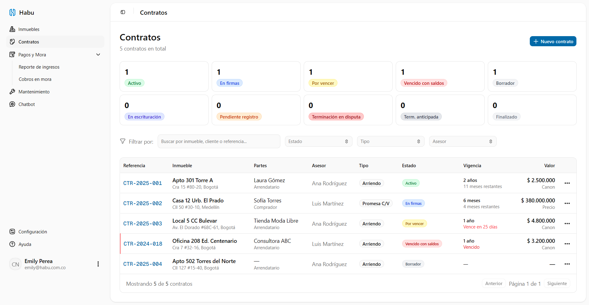
---

| Interfaz: UI-C02 | Realizado por: Emily Perea Córdoba |
| :---- | :---- |
| Descripción: Iniciar contrato. Interfaz para la selección inicial del inmueble, tipo de contrato y partes involucradas. | |
| RF: RF-28 | |

**Mockup:**

---

| Interfaz: UI-C03 | Realizado por: Emily Perea Córdoba |
| :---- | :---- |
| Descripción: Formulario contrato de arriendo. Permite registrar información específica como el canon, fechas, depósito y administración. | |
| RF: RF-28 | |

**Mockup:**

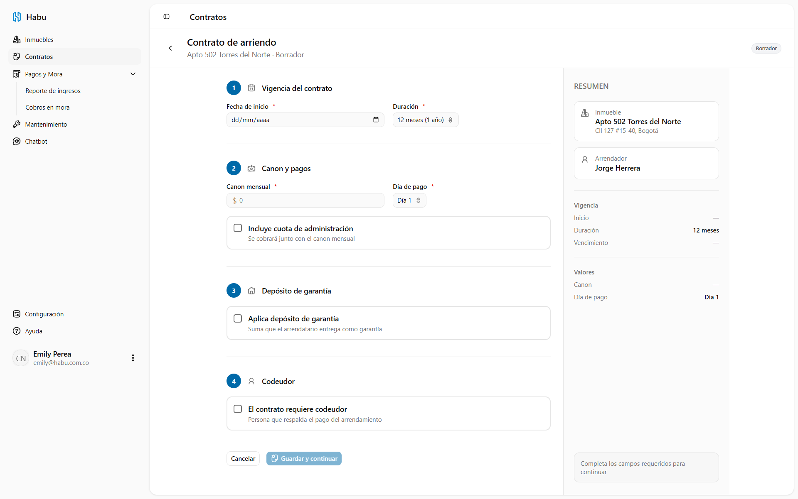
---

| Interfaz: UI-C04 | Realizado por: Emily Perea Córdoba |
| :---- | :---- |
| Descripción: Formulario promesa de compraventa. Permite registrar precio, arras, forma de pago y fecha de escrituración. | |
| RF: RF-28 | |

**Mockup:**

---

| Interfaz: UI-C05 | Realizado por: Emily Perea Córdoba |
| :---- | :---- |
| Descripción: Gestión de documentos. Muestra la lista de chequeo de documentos obligatorios y permite la carga de archivos. | |
| RF: RF-31 | |

**Mockup:**

---

| Interfaz: UI-C06 | Realizado por: Emily Perea Córdoba |
| :---- | :---- |
| Descripción: Detalle de contrato. Vista detallada mostrando el estado actual, partes, documentos y firmas asociadas a un contrato. | |
| RF: RF-28 | |

**Mockup:**

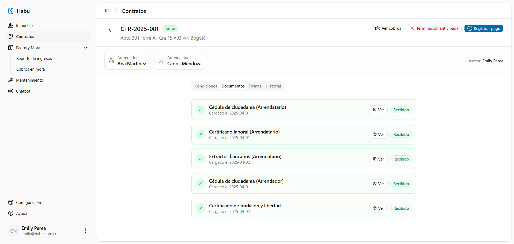

---

| Interfaz: UI-C07 | Realizado por: Emily Perea Córdoba |
| :---- | :---- |
| Descripción: Registrar escrituración. Interfaz para asentar la fecha, notaría, pagos pendientes y certificado de tradición en contratos de venta. | |
| RF: RF-32 | |

**Mockup:**
*(Inserta aquí la captura de pantalla de la interfaz)*

---

| Interfaz: UI-C08 | Realizado por: Emily Perea Córdoba |
| :---- | :---- |
| Descripción: Registrar terminación anticipada. Formulario para indicar causa, penalizaciones y fecha de entrega. | |
| RF: RF-33 | |

**Mockup:**

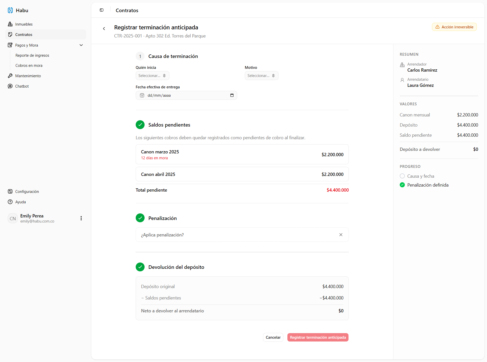
---

| Interfaz: UI-C09 | Realizado por: Emily Perea Córdoba |
| :---- | :---- |
| Descripción: Gestionar vencimiento y renovación. Muestra alertas de vencimiento y permite tomar la decisión de renovar o finalizar el contrato. | |
| RF: RF-29 | |

**Mockup:**
*(Inserta aquí la captura de pantalla de la interfaz)*

## Módulo de Pagos y Mora

| Interfaz: UI-P01 | Realizado por: Emily Perea Córdoba |
| :---- | :---- |
| Descripción: Lista de cobros de un contrato. Muestra estado, fecha límite y valor de cada cuota generada. | |
| RF: RF-34, RF-36 | |

**Mockup:**

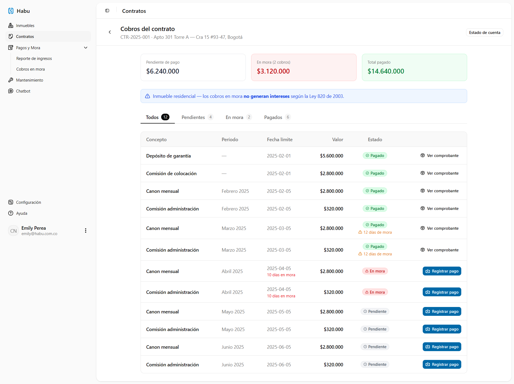

---

| Interfaz: UI-P02 | Realizado por: Emily Perea Córdoba |
| :---- | :---- |
| Descripción: Registrar pago. Interfaz para la selección de cobro, ingreso de valor, fecha y carga del comprobante de pago. | |
| RF: RF-35 | |

**Mockup:**

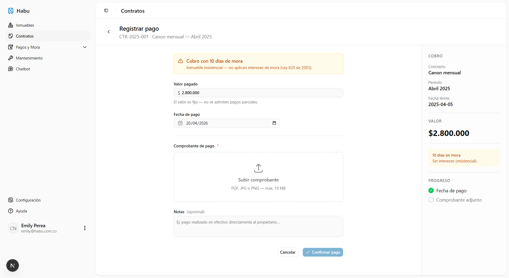
---

| Interfaz: UI-P03 | Realizado por: Emily Perea Córdoba |
| :---- | :---- |
| Descripción: Estado de cuenta. Muestra el historial cronológico de pagos, mora e intereses de un contrato. | |
| RF: RF-39 | |

**Mockup:**

---

| Interfaz: UI-P04 | Realizado por: Emily Perea Córdoba |
| :---- | :---- |
| Descripción: Generar reporte de ingresos. Interfaz de consulta con filtros por periodo, cliente o inmueble para reportes financieros. | |
| RF: RF-40 | |

**Mockup:**

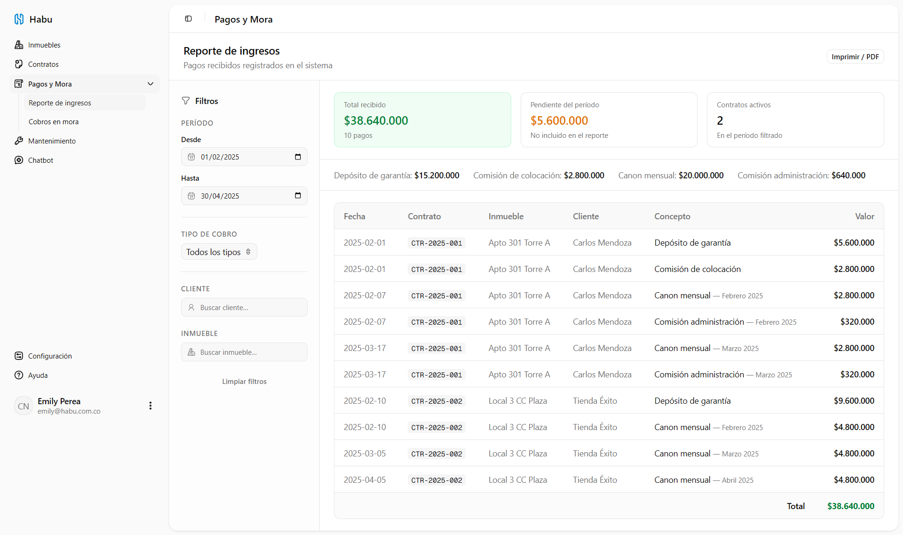
---

| Interfaz: UI-P05 | Realizado por: Emily Perea Córdoba |
| :---- | :---- |
| Descripción: Vista de cobros en mora. Listado de cobros vencidos con intereses acumulados calculados. | |
| RF: RF-36, RF-37 | |

**Mockup:**

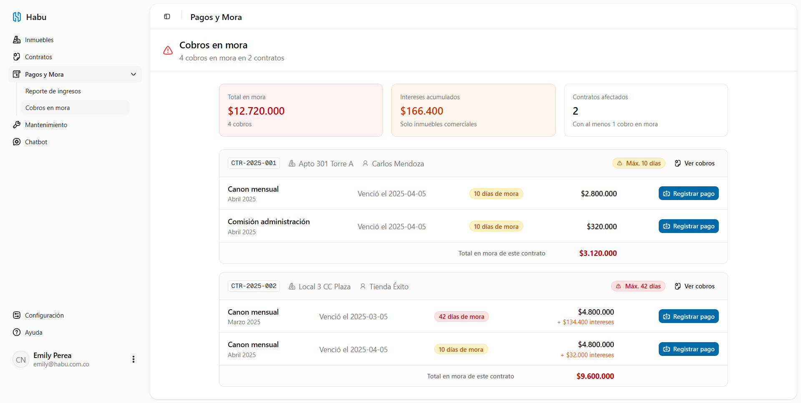
## Módulo de Inmuebles

| Interfaz: UI-I01 | Realizado por: Emily Perea Córdoba |
| :---- | :---- |
| Descripción: Lista de inmuebles. Vista general con resumen en cards y filtros por tipo, estado y modalidad. | |
| RF: RF-17 | |

**Mockup:**

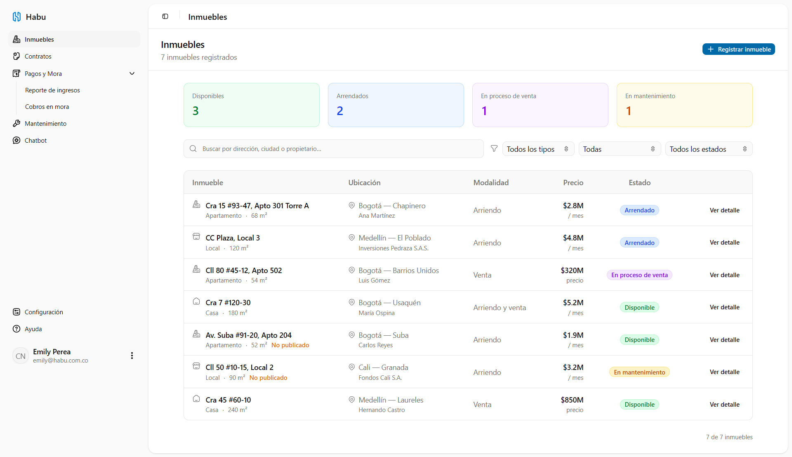
---

| Interfaz: UI-I02 | Realizado por: Emily Perea Córdoba |
| :---- | :---- |
| Descripción: Registrar inmueble. Página completa para el ingreso de datos del inmueble y carga de galería de fotos. | |
| RF: RF-13, RF-14, RF-15, RF-16 | |

**Mockup:**

---

| Interfaz: UI-I03 | Realizado por: Emily Perea Córdoba |
| :---- | :---- |
| Descripción: Detalle del inmueble. Interfaz organizada en pestañas (Info, Fotos, Historial de cambios) para consultar el inmueble. | |
| RF: RF-13, RF-14, RF-19 | |

**Mockup:**

---

| Interfaz: UI-I04 | Realizado por: Emily Perea Córdoba |
| :---- | :---- |
| Descripción: Editar inmueble. Interfaz basada en el registro (modo edición) para actualizar las propiedades y estado del inmueble. | |
| RF: RF-18 | |

**Mockup:**
*(Inserta aquí la captura de pantalla de la interfaz)*

## Módulo de Administración

| Interfaz: UI-A01 | Realizado por: Emily Perea Córdoba |
| :---- | :---- |
| Descripción: Lista de usuarios. Tabla con filtros por rol y estado, con acciones para activar/desactivar y acceso a creación/edición de usuarios desde un dialog. | |
| RF: RF-01, RF-02, RF-05 | |

**Mockup:**
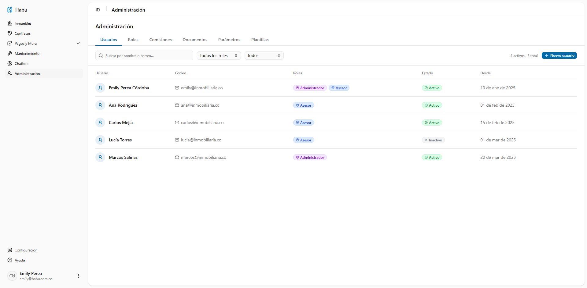
---

| Interfaz: UI-A02 | Realizado por: Emily Perea Córdoba |
| :---- | :---- |
| Descripción: Crear / Editar usuario. Dialog con campos de nombre, correo, rol y estado. Se accede desde UI-A01. | |
| RF: RF-01, RF-02, RF-04 | |

**Mockup:**

---

| Interfaz: UI-A03 | Realizado por: Emily Perea Córdoba |
| :---- | :---- |
| Descripción: Roles y permisos. Matriz de permisos por módulo y acción (ver, crear, editar, eliminar) organizada por rol. Vista de solo lectura. | |
| RF: RF-03, RF-04 | |

**Mockup:**

---

| Interfaz: UI-A04 | Realizado por: Emily Perea Córdoba |
| :---- | :---- |
| Descripción: Esquemas de comisión. Layout maestro-detalle: lista de esquemas a la izquierda y panel de asignación a asesores a la derecha. El dialog de creación/edición incluye tipo de comisión, dos tasas diferenciadas (inmobiliaria y asesor) y un simulador en tiempo real. | |
| RF: RF-08, RF-09 | |

**Mockup:**
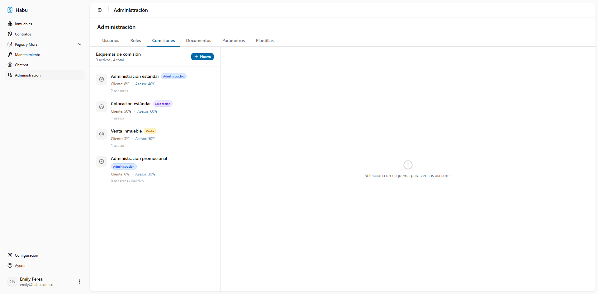

---

| Interfaz: UI-A05 | Realizado por: Emily Perea Córdoba |
| :---- | :---- |
| Descripción: Documentos requeridos. Tabla CRUD de tipos de documento con configuración de tipo de persona, tipo de inmueble, si aplica a codeudor y toggle de obligatorio. | |
| RF: RF-11 | |

**Mockup:**
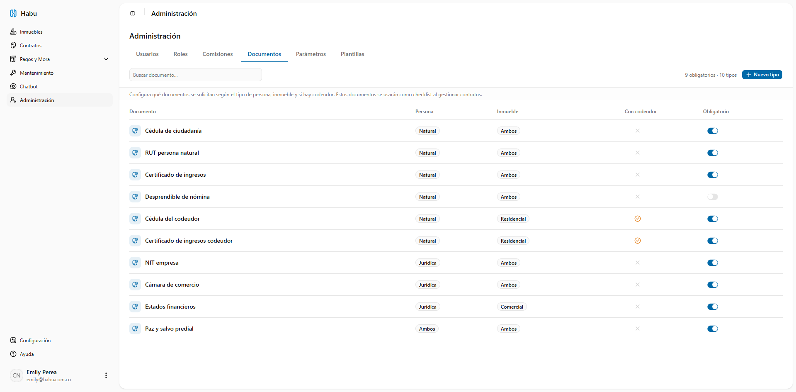
---

| Interfaz: UI-A06 | Realizado por: Emily Perea Córdoba |
| :---- | :---- |
| Descripción: Parámetros del sistema. Formulario para configurar el periodo de gracia de mora (días hábiles), tasas de interés por tipo de contrato (residencial/comercial) y días de anticipación para alertas de vencimiento y renovación. Incluye advertencia legal sobre la Ley 820/2003. | |
| RF: RF-12 | |

**Mockup:**

---

| Interfaz: UI-A07 | Realizado por: Emily Perea Córdoba |
| :---- | :---- |
| Descripción: Plantillas de documentos. Layout maestro-detalle: lista de plantillas a la izquierda (con tipo, fecha de última edición y acciones) y panel derecho con dos modos: editor TipTap con barra de formato y paleta de variables (inserción al cursor) o preview con datos de ejemplo resaltados. Permite imprimir o exportar como PDF. | |
| RF: RF-10 | |

**Mockup:**

## Módulo de Login / Autenticación

| Interfaz: UI-L01 | Realizado por: Emily Perea Córdoba |
| :---- | :---- |
| Descripción: Login. Formulario de inicio de sesión con correo y contraseña. Incluye toggle de visibilidad de contraseña, enlace a recuperación y manejo de estados de error (credenciales incorrectas, cuenta inactiva). No hay registro propio — los usuarios son creados por el administrador desde UI-A01. | |
| RF: RF-01, RF-05 | |

**Mockup:**
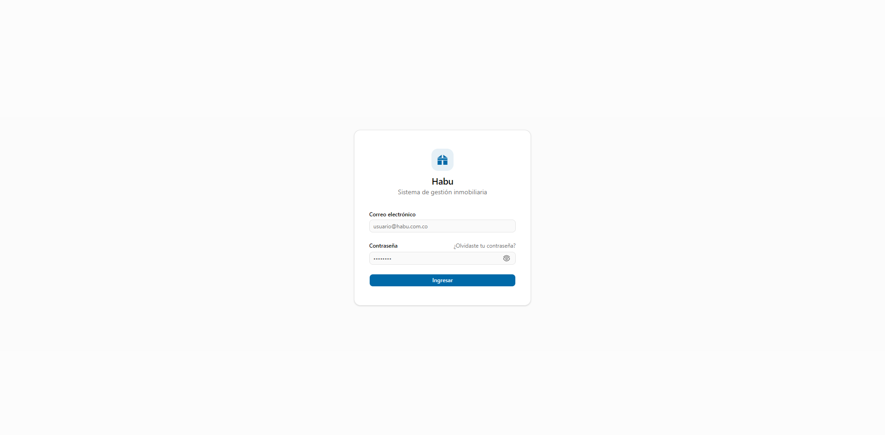

---

| Interfaz: UI-L02 | Realizado por: Emily Perea Córdoba |
| :---- | :---- |
| Descripción: Recuperar contraseña. Formulario para ingresar el correo al que se enviará el enlace de restablecimiento. Muestra un estado de confirmación genérico (no revela si el correo existe) con instrucciones para revisar la bandeja de entrada. | |
| RF: RF-01 | |

**Mockup:**
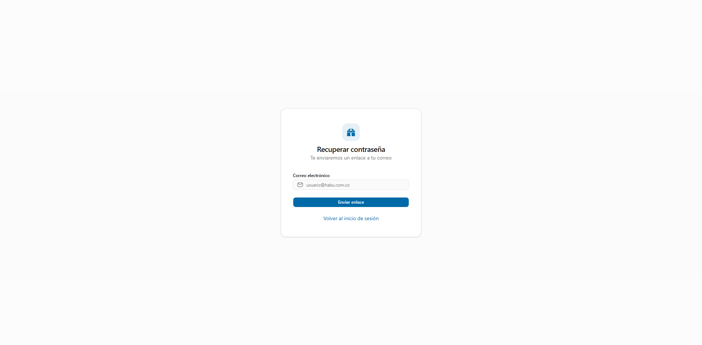
---

| Interfaz: UI-L03 | Realizado por: Emily Perea Córdoba |
| :---- | :---- |
| Descripción: Restablecer contraseña. Formulario accesible desde el enlace del correo para definir una nueva contraseña. Incluye indicadores visuales de fortaleza (longitud mínima, mayúscula, número) y validación de coincidencia entre los dos campos. | |
| RF: RF-01 | |

**Mockup:**
