# Documento de Interfaces

A continuación se detallan las interfaces del sistema, mapeadas con sus respectivos Requisitos Funcionales (RF).

## Módulo de Contratos

| Interfaz: UI-C01 | Realizado por: Emily Perea Córdoba |
| :---- | :---- |
| Descripción: Lista de contratos. Vista general con filtros por estado, tipo y asesor. Permite gestionar y consultar los contratos registrados. | |
| RF: RF-28 | |

**Mockup:**

---

| Interfaz: UI-C02 | Realizado por: Emily Perea Córdoba |
| :---- | :---- |
| Descripción: Iniciar contrato. Interfaz para la selección inicial del inmueble, tipo de contrato y partes involucradas. | |
| RF: RF-28 | |

**Mockup:**

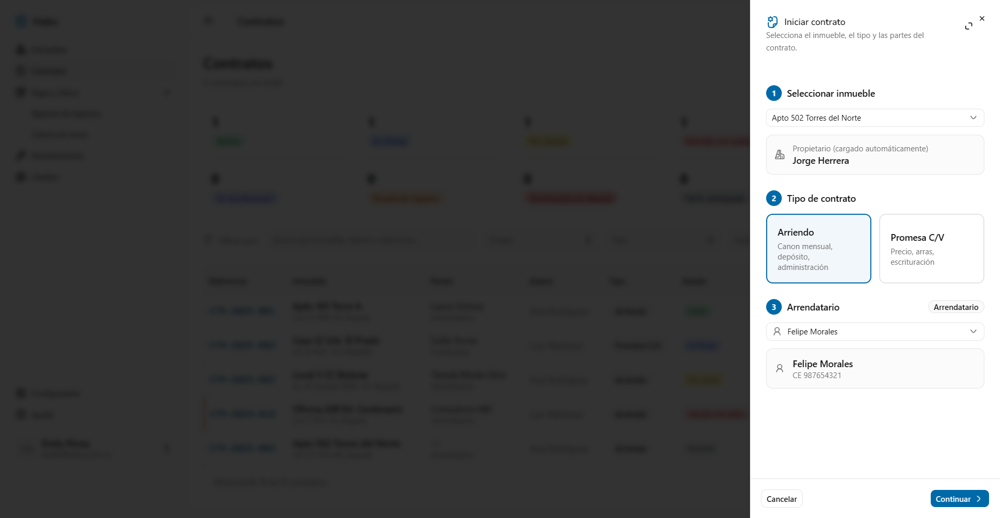
---

| Interfaz: UI-C03 | Realizado por: Emily Perea Córdoba |
| :---- | :---- |
| Descripción: Formulario contrato de arriendo. Permite registrar información específica como el canon, fechas, depósito y administración. | |
| RF: RF-28 | |

**Mockup:**

---

| Interfaz: UI-C04 | Realizado por: Emily Perea Córdoba |
| :---- | :---- |
| Descripción: Formulario promesa de compraventa. Permite registrar precio, arras, forma de pago y fecha de escrituración. | |
| RF: RF-28 | |

**Mockup:**
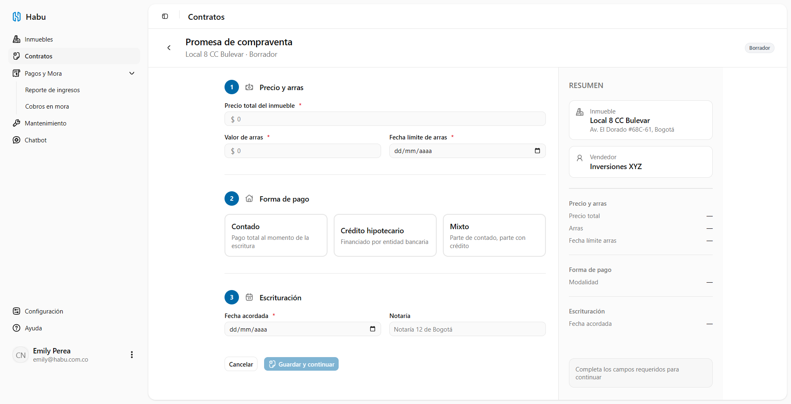

---

| Interfaz: UI-C05 | Realizado por: Emily Perea Córdoba |
| :---- | :---- |
| Descripción: Gestión de documentos. Muestra la lista de chequeo de documentos obligatorios y permite la carga de archivos. | |
| RF: RF-31 | |

**Mockup:**

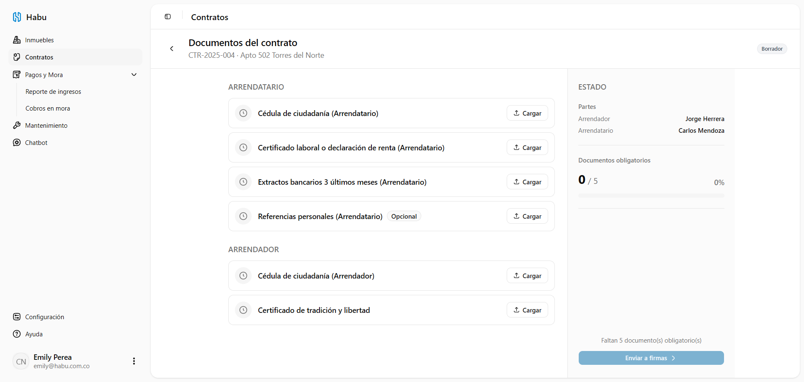
---

| Interfaz: UI-C06 | Realizado por: Emily Perea Córdoba |
| :---- | :---- |
| Descripción: Detalle de contrato. Vista detallada mostrando el estado actual, partes, documentos y firmas asociadas a un contrato. | |
| RF: RF-28 | |

**Mockup:**

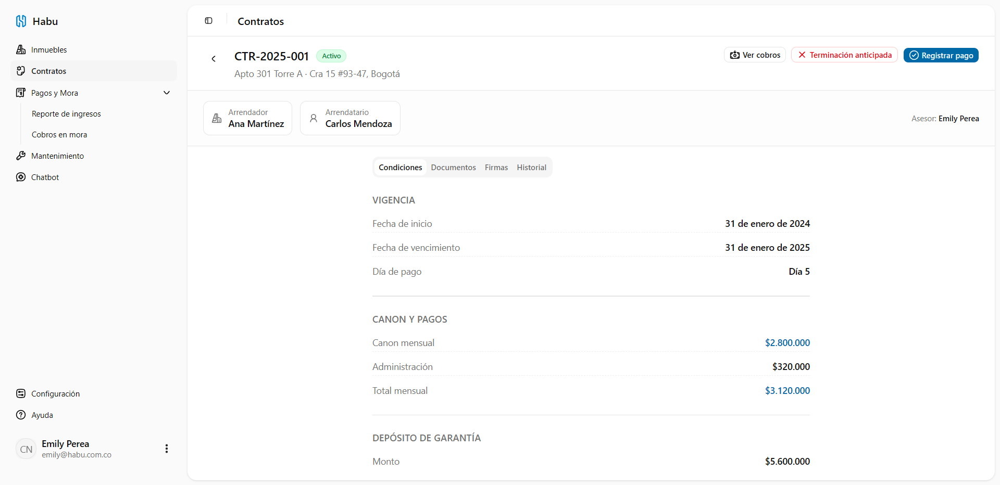

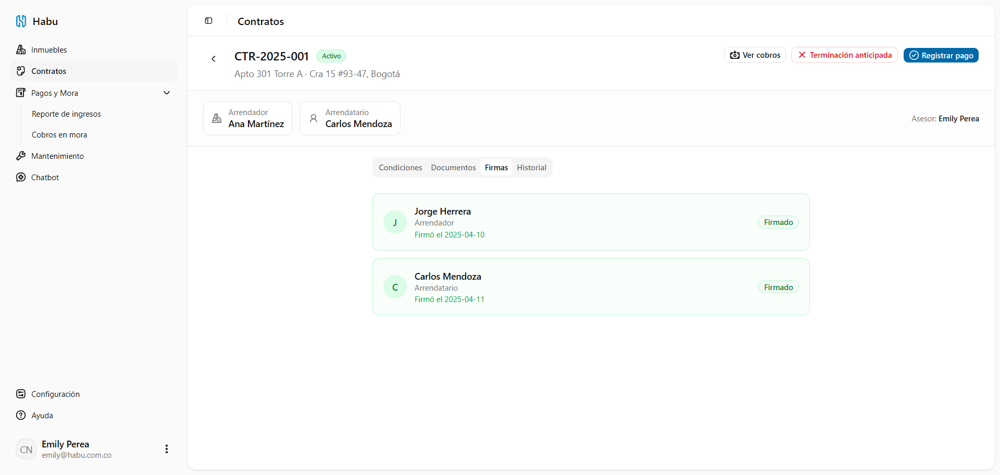
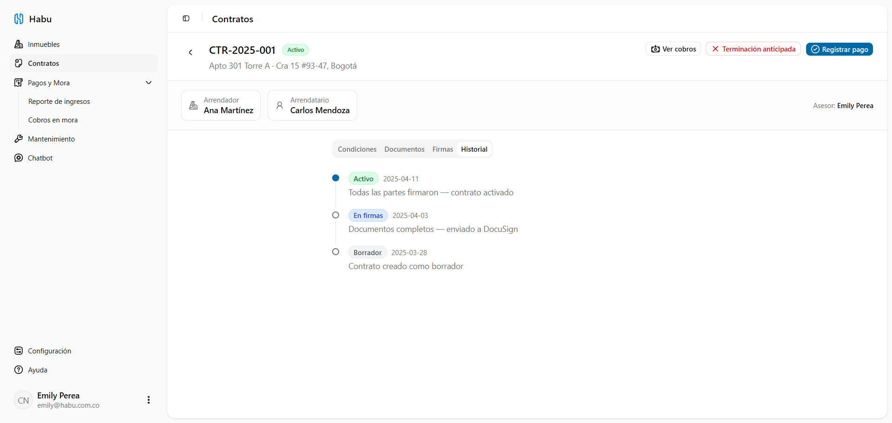
---

| Interfaz: UI-C07 | Realizado por: Emily Perea Córdoba |
| :---- | :---- |
| Descripción: Registrar escrituración. Interfaz para asentar la fecha, notaría, pagos pendientes y certificado de tradición en contratos de venta. | |
| RF: RF-32 | |

**Mockup:**
*(Inserta aquí la captura de pantalla de la interfaz)*

---

| Interfaz: UI-C08 | Realizado por: Emily Perea Córdoba |
| :---- | :---- |
| Descripción: Registrar terminación anticipada. Formulario para indicar causa, penalizaciones y fecha de entrega. | |
| RF: RF-33 | |

**Mockup:**

---

| Interfaz: UI-C09 | Realizado por: Emily Perea Córdoba |
| :---- | :---- |
| Descripción: Gestionar vencimiento y renovación. Muestra alertas de vencimiento y permite tomar la decisión de renovar o finalizar el contrato. | |
| RF: RF-29 | |

**Mockup:**
*(Inserta aquí la captura de pantalla de la interfaz)*

## Módulo de Pagos y Mora

| Interfaz: UI-P01 | Realizado por: Emily Perea Córdoba |
| :---- | :---- |
| Descripción: Lista de cobros de un contrato. Muestra estado, fecha límite y valor de cada cuota generada. | |
| RF: RF-34, RF-36 | |

**Mockup:**

---

| Interfaz: UI-P02 | Realizado por: Emily Perea Córdoba |
| :---- | :---- |
| Descripción: Registrar pago. Interfaz para la selección de cobro, ingreso de valor, fecha y carga del comprobante de pago. | |
| RF: RF-35 | |

**Mockup:**

---

| Interfaz: UI-P03 | Realizado por: Emily Perea Córdoba |
| :---- | :---- |
| Descripción: Estado de cuenta. Muestra el historial cronológico de pagos, mora e intereses de un contrato. | |
| RF: RF-39 | |

**Mockup:**

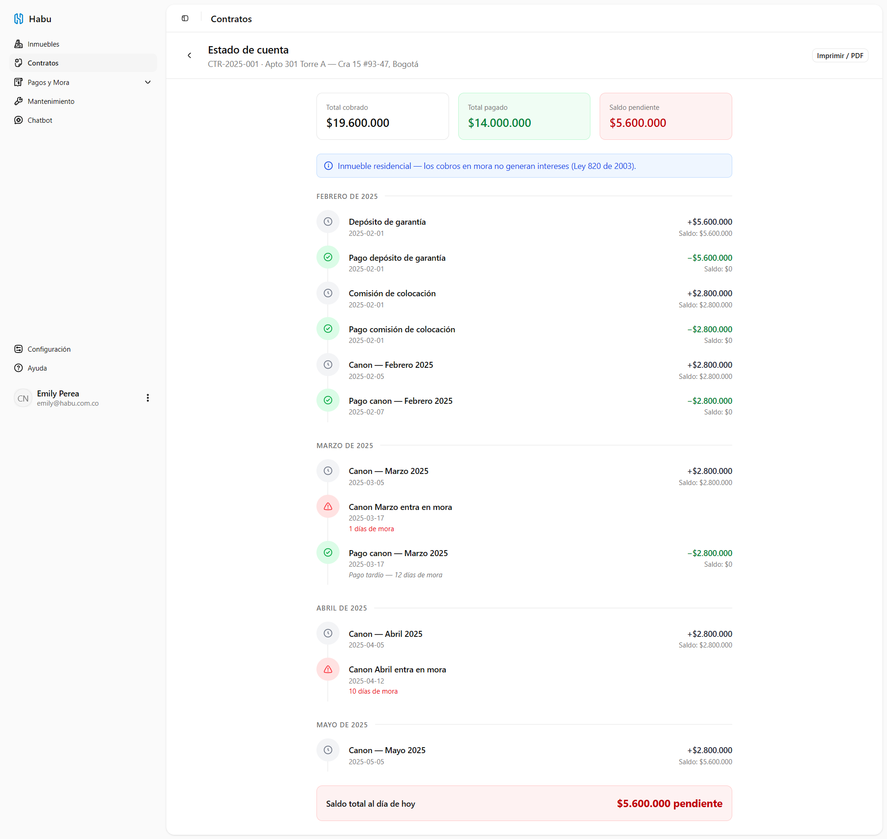
---

| Interfaz: UI-P04 | Realizado por: Emily Perea Córdoba |
| :---- | :---- |
| Descripción: Generar reporte de ingresos. Interfaz de consulta con filtros por periodo, cliente o inmueble para reportes financieros. | |
| RF: RF-40 | |

**Mockup:**

---

| Interfaz: UI-P05 | Realizado por: Emily Perea Córdoba |
| :---- | :---- |
| Descripción: Vista de cobros en mora. Listado de cobros vencidos con intereses acumulados calculados. | |
| RF: RF-36, RF-37 | |

**Mockup:**

## Módulo de Inmuebles

| Interfaz: UI-I01 | Realizado por: Emily Perea Córdoba |
| :---- | :---- |
| Descripción: Lista de inmuebles. Vista general con resumen en cards y filtros por tipo, estado y modalidad. | |
| RF: RF-17 | |

**Mockup:**

---

| Interfaz: UI-I02 | Realizado por: Emily Perea Córdoba |
| :---- | :---- |
| Descripción: Registrar inmueble. Página completa para el ingreso de datos del inmueble y carga de galería de fotos. | |
| RF: RF-13, RF-14, RF-15, RF-16 | |

**Mockup:**

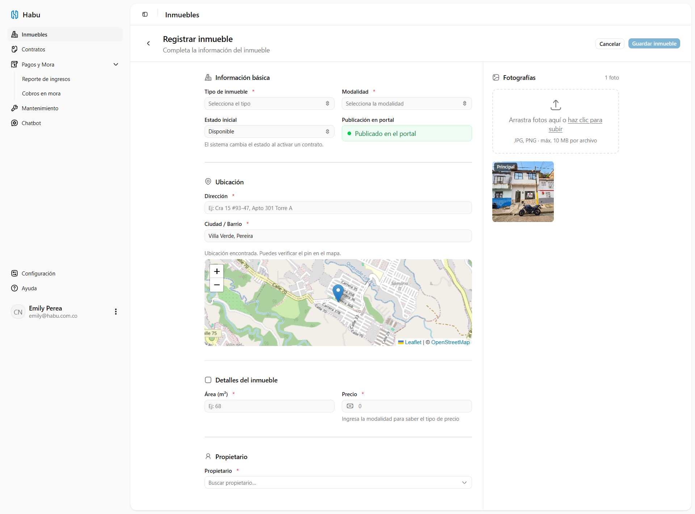
---

| Interfaz: UI-I03 | Realizado por: Emily Perea Córdoba |
| :---- | :---- |
| Descripción: Detalle del inmueble. Interfaz organizada en pestañas (Info, Fotos, Historial de cambios) para consultar el inmueble. | |
| RF: RF-13, RF-14, RF-19 | |

**Mockup:**

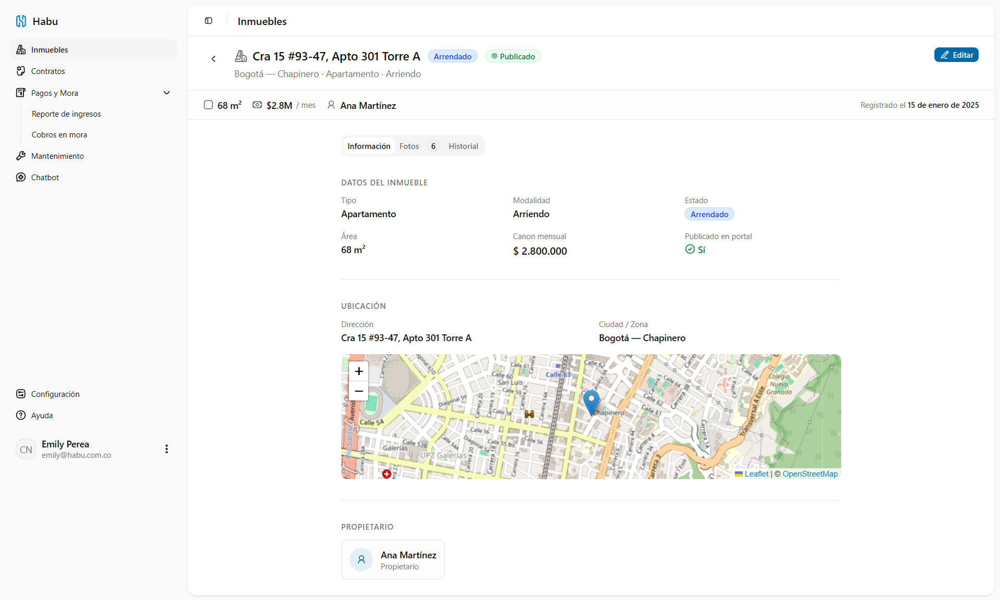
---

| Interfaz: UI-I04 | Realizado por: Emily Perea Córdoba |
| :---- | :---- |
| Descripción: Editar inmueble. Interfaz basada en el registro (modo edición) para actualizar las propiedades y estado del inmueble. | |
| RF: RF-18 | |

**Mockup:**
*(Inserta aquí la captura de pantalla de la interfaz)*

## Módulo de Clientes

| Interfaz: UI-CL01 | Realizado por: Emily Perea Córdoba |
| :---- | :---- |
| Descripción: Lista de clientes. Tabla con filtros por tipo, búsqueda por nombre/documento y acceso al detalle. | |
| RF: RF-20, RF-21 | |

**Mockup:**
*(Inserta aquí la captura de pantalla de la interfaz)*

---

| Interfaz: UI-CL02 | Realizado por: Emily Perea Córdoba |
| :---- | :---- |
| Descripción: Registrar / Editar cliente. Formulario de datos personales adaptado según tipo de persona (natural o jurídica). | |
| RF: RF-20, RF-22 | |

**Mockup:**
*(Inserta aquí la captura de pantalla de la interfaz)*

---

| Interfaz: UI-CL03 | Realizado por: Emily Perea Córdoba |
| :---- | :---- |
| Descripción: Detalle del cliente. Vista en pestañas: datos personales, inmuebles asociados, contratos e historial de interacciones. | |
| RF: RF-21, RF-23 | |

**Mockup:**
*(Inserta aquí la captura de pantalla de la interfaz)*

---

| Interfaz: UI-CL04 | Realizado por: Emily Perea Córdoba |
| :---- | :---- |
| Descripción: Registrar interacción. Sheet lateral para registrar visitas, llamadas, mensajes o notas asociadas a un cliente. | |
| RF: RF-23 | |

**Mockup:**
*(Inserta aquí la captura de pantalla de la interfaz)*

---

## Módulo de Cuenta y perfil

| Interfaz: UI-ACC01 | Realizado por: Emily Perea Córdoba |
| :---- | :---- |
| Descripción: Mi cuenta. Vista en pestañas: datos personales (nombre, correo, teléfono, ciudad), seguridad (cambiar contraseña con indicador de fortaleza) y notificaciones (toggles de alertas del sistema). Accesible desde el avatar en el footer del sidebar. | |
| RF: RF-01, RF-02 | |

**Mockup:**
*(Inserta aquí la captura de pantalla de la interfaz)*

---

## Módulo de Administración

| Interfaz: UI-A01 | Realizado por: Emily Perea Córdoba |
| :---- | :---- |
| Descripción: Lista de usuarios. Tabla con filtros por rol y estado, con acciones para activar/desactivar y acceso a creación/edición de usuarios desde un dialog. | |
| RF: RF-01, RF-02, RF-05 | |

**Mockup:**

---

| Interfaz: UI-A02 | Realizado por: Emily Perea Córdoba |
| :---- | :---- |
| Descripción: Crear / Editar usuario. Dialog con campos de nombre, correo, rol y estado. Se accede desde UI-A01. | |
| RF: RF-01, RF-02, RF-04 | |

**Mockup:**
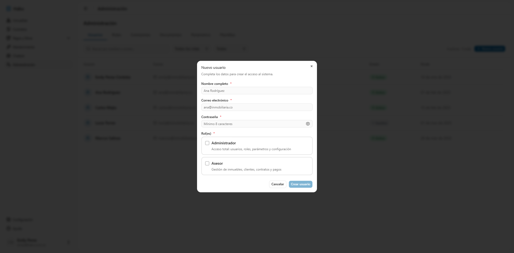
---

| Interfaz: UI-A03 | Realizado por: Emily Perea Córdoba |
| :---- | :---- |
| Descripción: Roles y permisos. Matriz de permisos por módulo y acción (ver, crear, editar, eliminar) organizada por rol. Vista de solo lectura. | |
| RF: RF-03, RF-04 | |

**Mockup:**
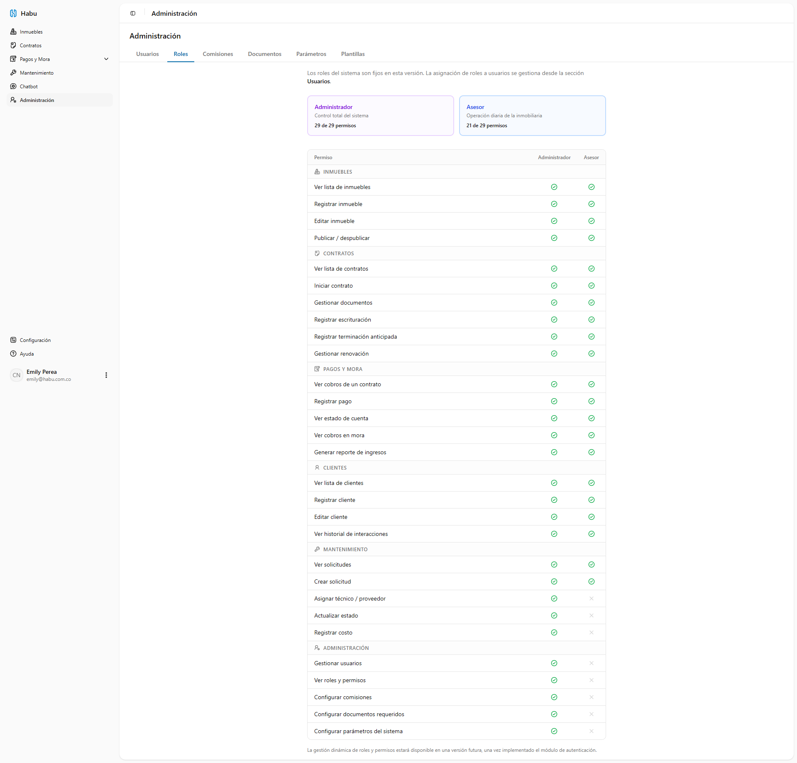

---

| Interfaz: UI-A04 | Realizado por: Emily Perea Córdoba |
| :---- | :---- |
| Descripción: Esquemas de comisión. Lista de esquemas con tasas diferenciadas (inmobiliaria y asesor) y panel de asignación a asesores. | |
| RF: RF-08, RF-09 | |

**Mockup:**

---

| Interfaz: UI-A05 | Realizado por: Emily Perea Córdoba |
| :---- | :---- |
| Descripción: Documentos requeridos. Tabla CRUD para configurar los tipos de documento obligatorios según persona, inmueble y rol. | |
| RF: RF-11 | |

**Mockup:**

---

| Interfaz: UI-A06 | Realizado por: Emily Perea Córdoba |
| :---- | :---- |
| Descripción: Parámetros del sistema. Formulario para configurar periodo de gracia de mora, tasas de interés y días de alerta para vencimientos. | |
| RF: RF-12 | |

**Mockup:**

---

| Interfaz: UI-A07 | Realizado por: Emily Perea Córdoba |
| :---- | :---- |
| Descripción: Plantillas de documentos. Editor TipTap con paleta de variables y vista previa. Permite crear, editar y exportar plantillas en PDF. | |
| RF: RF-10 | |

**Mockup:**
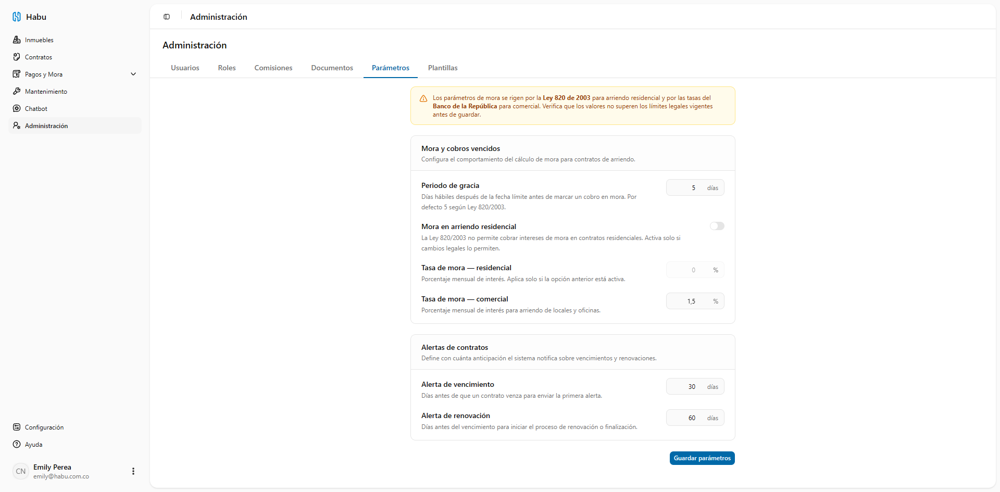
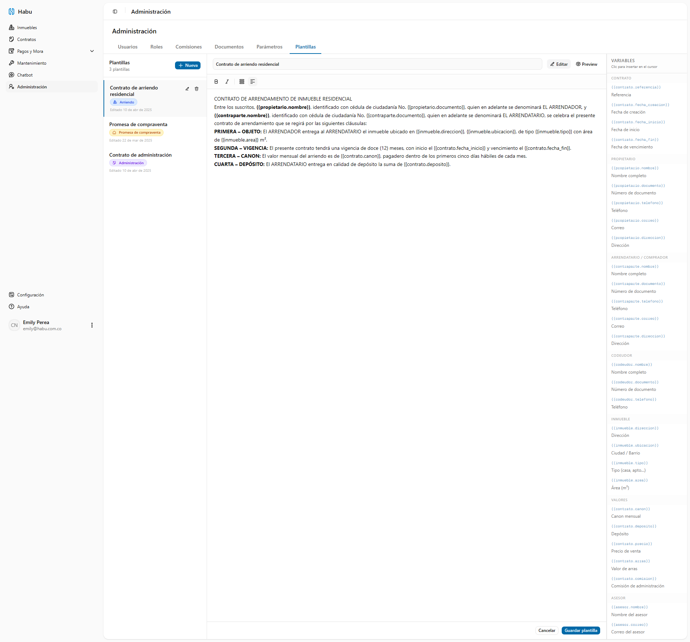
## Módulo de Login / Autenticación

| Interfaz: UI-L01 | Realizado por: Emily Perea Córdoba |
| :---- | :---- |
| Descripción: Login. Formulario de inicio de sesión con correo y contraseña. Los usuarios son creados por el administrador desde UI-A01. | |
| RF: RF-01, RF-05 | |

**Mockup:**

---

| Interfaz: UI-L02 | Realizado por: Emily Perea Córdoba |
| :---- | :---- |
| Descripción: Recuperar contraseña. Formulario para solicitar el enlace de restablecimiento por correo. | |
| RF: RF-01 | |

**Mockup:**

---

| Interfaz: UI-L03 | Realizado por: Emily Perea Córdoba |
| :---- | :---- |
| Descripción: Restablecer contraseña. Formulario para definir una nueva contraseña con indicadores de fortaleza. | |
| RF: RF-01 | |

**Mockup:**
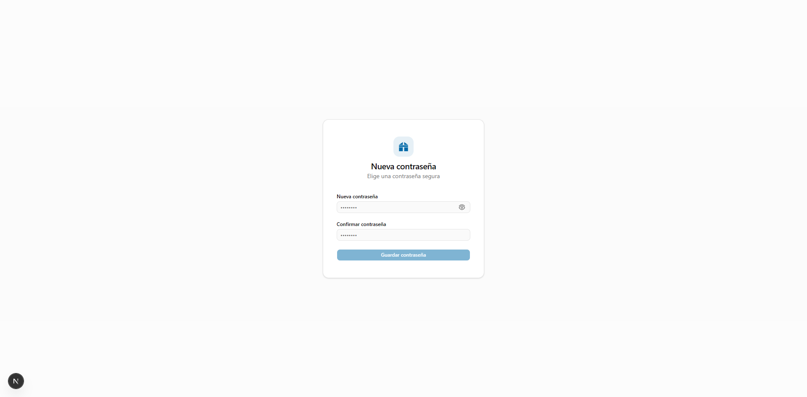